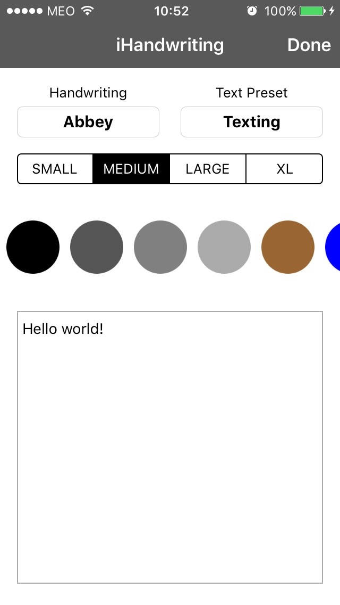

# iHandWriting (iOS)

Hello there! My name is Luis Da Costa and this is my version of a HandWriting.io app for iOS.

## Idea

**The Idea** was to simply create an iOS app based on the [API](https://handwriting.io/docs/) provided by [HandWriting.io](https://handwriting.io/). It was based on the base functions provided by the [demo](https://handwriting.io/), in which I added a touch of creativity in order to avoid being exactly the same as the demo provided.

## Design
**The Design** is based on the following ideas:

* Follow the [iOS Human Interface Guidelines](https://developer.apple.com/go/?id=app-review-ios-hig) provided by Apple
* Show only the most relevant informations on the screen
* Best user friendly experience
* Beautiful to the touch, beautiful to the eyes

The result is a simple "dual view", which is devised on two sections:

####The Main (First) screen (with the options)
 

####The Second (Final) screen (with the final result)

####The final result is something among those lines

## Frameworks
**For iHandWriting** two frameworks have been used, both installed/managed by [CocoaPods](https://cocoapods.org/):

* **[Alamofire](https://github.com/Alamofire/Alamofire) (MIT License):** For the API Requests (basic_auth and error handling)
* **[IQKeyboardManager](https://github.com/hackiftekhar/IQKeyboardManager) (MIT License):** Helping with the management of the keyboard when typing the text to be sent to the server

The usage of both frameworks could have been avoided, same with any frameworks, but not using those two very important frameworks would mean:

* More code to manage
* More bugs to handle
* More usecases to think and adapt
* Less time spent on really usefull and awesome features

So yes, both frameworks could have been avoided, but the final cost would be in the final user experience. And this is why I decided to include them. Thanks to that the code clean and the application is simple to use and to handle.

## How to use
1. **Select a HandWriting** (Optional - Default 'first on catalog')
2. **Select a Text Preset** (Optional - Default None)
3. **Select a size for the Text** (Optional - Default Medium: 20px)
4. **Select a bubble color from the Palette** (Optional - Default Black)
5. **Write a text (if no presset) to be converted** (Mandatory either with Keyboard Typing or Presset)
6. **Press the Done button**
7. **Wait for the result which will be displayed on the new window**
8. **Enjoy!**

## License
**iHandWriting** is released under the GPLv3 license. See LICENSE for details.